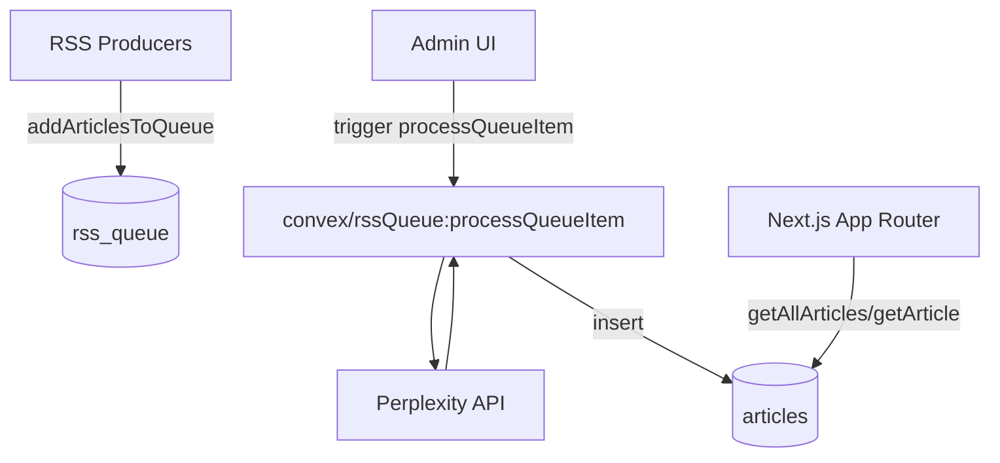

# Architecture

```mermaid
flowchart TD
  RSS[RSS Producers] -->|addArticlesToQueue| Q[(rss_queue)]
  Admin[Admin UI] -->|trigger processQueueItem| Action[convex/rssQueue:processQueueItem]
  Action --> Perp[Perplexity API]
  Perp --> Action
  Action -->|insert| Articles[(articles)]
  FE[Next.js App Router]
  FE -->|getAllArticles/getArticle| Articles
```

- Data store: Convex (`articles`, `rss_queue`, `categories`, `comments`)
- AI: Perplexity via `convex/rssQueue.ts`
- Rendering: Next.js App Router pages under `app/`
- Auth: Clerk
